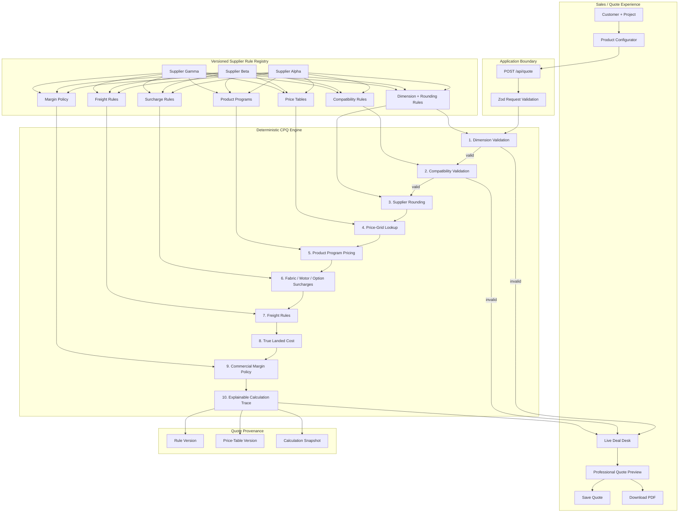

# Supplier Pricing Engine

[](https://github.com/Kohronburton/supplier-pricing-engine/actions/workflows/ci.yml)

**Live demo:** https://cpq.kohronburton.com  
**Built by:** [Kohron Burton](https://kohronburton.com)

A production-minded **Configure–Price–Quote (CPQ) reference implementation** for custom products where every supplier prices differently.

> **Core idea:** supplier behavior belongs in versioned rules and pricing data—not scattered `if/else` logic throughout the application.

## What the demo proves

The demo goes beyond a pricing calculator. It shows the full path from customer configuration to a professional quote:

- customer and project information
- quote number and expiration date
- supplier-specific product catalogs
- min/max size validation
- supplier-specific dimension rounding
- fabric, motor, control, and option compatibility
- width/height price-grid resolution
- product-program adjustments
- fixed and percentage surcharges
- standard and conditional freight rules
- true landed-cost calculation
- target margin and sell price
- visible gross profit
- invalid-configuration blocking
- explainable calculation trace
- rule-set and price-table version capture
- professional quote preview
- browser quote save
- direct PDF download
- crawl metadata, sitemap, robots, and Open Graph social preview
- automated regression tests and CI

## Try these three scenarios

The UI includes one-click scenarios designed to make the architecture visible in seconds:

| Scenario | What it demonstrates |
|---|---|
| Premium motorized | A valid Alpha quote with whole-inch rounding, premium fabric, motor pricing, freight, margin and audit trace |
| Catch a bad combo | Beta rejects an invalid blackout + motorized combination before a price is produced |
| Oversize designer | Gamma applies two-inch rounding, Zebra product pricing, smart motorization, oversize/tall freight and commercial margin |

## Architecture



## Pricing pipeline

```text
Customer configuration
        ↓
Boundary validation
        ↓
Supplier rule lookup
        ↓
Size validation
        ↓
Product / fabric / control / option compatibility
        ↓
Supplier-specific dimension rounding
        ↓
Width × height price-grid lookup
        ↓
Product-program adjustment
        ↓
Fabric + motor + option surcharges
        ↓
Freight rules
        ↓
True landed cost
        ↓
Target-margin sell price
        ↓
Explainable quote result
        ↓
Professional quote → Save → PDF
```

## Example: explainable pricing

```text
Input size:                   73.25 × 80.10 in
Supplier rounding:            next whole inch
Supplier size:                74 × 81 in

Price table:                  alpha-2026-q3
Grid base:                    $524.00
Premium fabric:               +$62.88
Motorized control:            +$185.00
Freight:                      +$55.00
------------------------------------------------
True landed cost:             $826.88
Target margin:                38%
Customer price:               $1,333.68
```

The successful quote also stores the exact `ruleVersion` and `gridVersion`, which is critical when supplier pricing changes after a quote was created.

## Multi-product supplier catalog

V4 removes the single disabled-product limitation. Each supplier now owns a product program:

- **Alpha:** Roller, Solar, Roman
- **Beta:** Roller, Solar, Cellular
- **Gamma:** Roller, Solar, Zebra

The same pricing engine executes all of them. Product behavior is supplier data, not a separate application flow.

## Invalid configurations fail before pricing

Example: Supplier Beta rejects Blackout fabric with its Motorized control.

```text
Configuration blocked
└── Motorized is not compatible with Blackout fabric for Supplier Beta.
```

That is intentional. A CPQ system should prevent invalid orders upstream instead of letting them become downstream fulfillment problems.

## Quote workflow

A valid configuration can be turned into a quote with:

1. customer and project information
2. quote number and 30-day validity window
3. professional on-screen preview
4. local browser save for demo persistence
5. one-click PDF export
6. rule and price-table provenance on the quote

The PDF is generated client-side without placing an LLM or external document service in the authoritative pricing path.

## Repository structure

```text
app/
├── api/quote/route.ts       # validated quote API
├── page.tsx                 # interactive CPQ + quote workflow
├── globals.css
├── v3.css
├── v4.css                   # V4 product/quote presentation
├── opengraph-image.tsx      # generated social preview
├── robots.ts
└── sitemap.ts

src/
├── domain/models.ts         # typed CPQ domain model
├── engine/pricing-engine.ts # supplier-agnostic calculation pipeline
├── suppliers/rules.ts       # supplier rules, catalogs and grids
└── validation/quote-schema.ts

tests/
└── pricing-engine.test.ts   # regression coverage
```

## Adding another supplier

The design goal is simple:

> **Adding Supplier Delta should mean adding product/rule/pricing data—not rewriting the pricing engine.**

See [Adding a Supplier Without Rewriting the Engine](docs/adding-a-supplier.md).

## Technology

- Next.js 15
- React 19
- TypeScript
- Zod
- Vitest
- GitHub Actions
- Vercel
- Custom domain: `cpq.kohronburton.com`

Production evolution would typically add PostgreSQL-backed rule/catalog persistence, supplier spreadsheet imports, authentication/RBAC, approval workflows, quote history, payment processing, and order creation.

## Quick start

```bash
git clone https://github.com/Kohronburton/supplier-pricing-engine.git
cd supplier-pricing-engine
npm install
npm run dev
```

Open `http://localhost:3000`.

Run regression tests:

```bash
npm test
```

Run a production build:

```bash
npm run build
```

## Design principles

- **Deterministic:** no LLM controls authoritative pricing.
- **Supplier-agnostic core:** suppliers provide rule/data definitions.
- **Explainable:** every meaningful pricing step produces a trace.
- **Versionable:** quotes retain rule and price-table versions.
- **Fail-fast:** invalid configurations are blocked before pricing.
- **Testable:** supplier edge cases live in automated regression tests.
- **Extensible:** product catalogs and supplier rules can grow without duplicating the quoting workflow.

---

Built by **[Kohron Burton](https://kohronburton.com)** · [View the live demo](https://cpq.kohronburton.com) · [View source](https://github.com/Kohronburton/supplier-pricing-engine)
