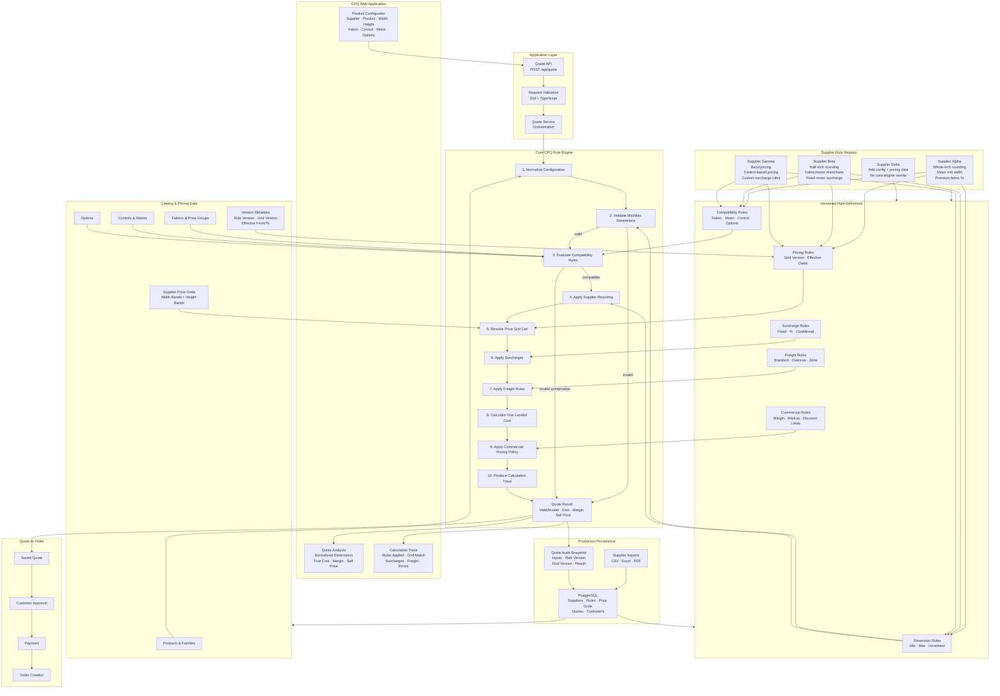
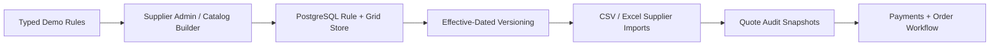

# Supplier Pricing Engine

A configurable **CPQ (Configure–Price–Quote) reference architecture** for supplier-specific window-covering pricing, product validation, price-grid lookup, surcharges, freight, margins, and explainable quoting.

> **Core principle:** supplier-specific behavior is configuration and data—not scattered application conditionals.

## Why this exists

Custom-product quoting becomes difficult when every supplier uses a different pricing model. One supplier may round dimensions to the next whole inch, another to the next half inch, while others use width/height bands, product-specific compatibility rules, motor restrictions, surcharges, and freight thresholds.

This repository demonstrates how to put those differences behind one deterministic, testable pricing pipeline.

## Architecture



## Pricing execution model

```text
Raw configuration
      ↓
Schema validation
      ↓
Supplier rule resolution
      ↓
Dimension validation
      ↓
Compatibility validation
      ↓
Supplier-specific rounding
      ↓
Price-grid lookup
      ↓
Surcharges + options
      ↓
Freight
      ↓
True landed cost
      ↓
Margin / sell-price policy
      ↓
Explainable quote result
```

## Explainable pricing

The engine returns both the price and the reasoning used to calculate it:

```text
Input width:                 73.25 in
Supplier rounding rule:     next whole inch
Normalized width:           74 in

Input height:                80.10 in
Supplier rounding rule:     next whole inch
Normalized height:          81 in

Price grid:                  Alpha 2026-Q3
Grid match:                  W74 × H81
Base cost:                   $524.00
Premium fabric surcharge:   +12%
Motorization:                +$185.00
Freight:                     +$55.00
------------------------------------------------
True landed cost:            $826.88
Target margin:               38%
Final sell price:            $1,333.68
```

This trace is intended to make support, audit, supplier disputes, and regression testing significantly easier.

## Design goals

- **Deterministic:** authoritative pricing does not depend on an LLM.
- **Supplier-agnostic core:** adding a supplier should not require editing the pricing pipeline.
- **Versionable:** historical quotes retain the rule/grid versions used at quote time.
- **Explainable:** every normalization, surcharge, freight rule, and price-grid match can be traced.
- **Testable:** supplier edge cases are encoded as automated regression tests.
- **Production-oriented:** the demo uses typed in-memory fixtures while preserving a clean path to PostgreSQL-backed rules and price grids.

## Demo suppliers

| Supplier | Rounding | Pricing | Key Rules |
|---|---|---|---|
| Alpha | Next whole inch | Width/height grid | Motor minimum width, premium-fabric percentage, oversize freight |
| Beta | Next 1/2 inch | Width/height grid | Fabric/motor compatibility, fixed motor surcharge |
| Gamma | Band-based | Width/height bands | Control-based pricing, custom surcharge policies |

## Planned production evolution



## Technology direction

- Next.js + React + TypeScript
- Zod for boundary validation
- Tailwind CSS for the demo UI
- Vitest for pricing regression tests
- PostgreSQL for production supplier/rule/catalog persistence
- Stripe for production payment flow

## Status

The repository is being built as an executable architecture demonstration. The first milestone is a working supplier-agnostic pricing pipeline with Alpha/Beta/Gamma rule sets, explainable calculations, invalid-configuration handling, and automated tests.
