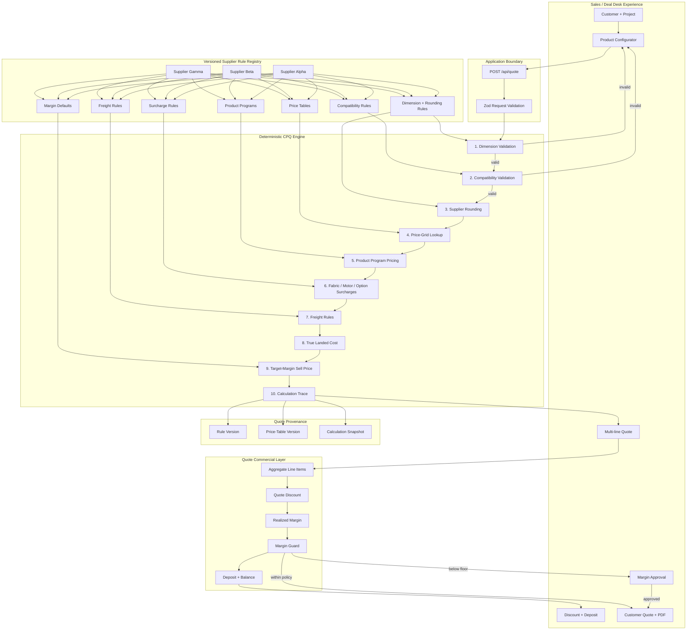

# Supplier Pricing Engine

[](https://github.com/Kohronburton/supplier-pricing-engine/actions/workflows/ci.yml)

A working **Configure–Price–Quote (CPQ) architecture case study** for custom products where every supplier has a different rulebook.

**Case study:** https://cpq.kohronburton.com  
**Interactive quote studio:** https://cpq.kohronburton.com/demo  
**Architecture decisions:** [docs/architecture-decisions.md](docs/architecture-decisions.md)  
**Built by:** [Kohron Burton](https://kohronburton.com)

> **Core principle:** supplier behavior changes frequently; the pricing engine should not have to.

---

## The business problem

The difficult part of a supplier-heavy quoting system is not drawing the quote screen.

It is making one sales workflow handle suppliers that disagree about:

- minimum and maximum dimensions
- dimension rounding
- product availability
- fabrics, motors, controls, and options
- incompatible product combinations
- width × height price grids
- percentage and fixed surcharges
- freight and oversize handling
- target margins and discount policy

A simple implementation usually turns into supplier-specific conditions spread across forms, APIs, and pricing code. That becomes expensive to test and risky to change.

This project demonstrates a different approach: **one deterministic pricing pipeline backed by versioned supplier rules and pricing data.**

---

## The important architecture decisions

| Decision | Why it matters |
|---|---|
| **No LLM in the authoritative price path** | The same inputs + rule versions should always produce the same price. Pricing must be reproducible, auditable, and regression-testable. |
| **Supplier behavior is data-driven** | Adding or changing a supplier should primarily change rule/catalog data, not the core pricing engine. |
| **Rules and price tables are versioned** | Historical quotes can be reproduced after a supplier publishes new pricing. |
| **Validation happens before pricing** | A numerical price for an impossible configuration is still a bad quote. Invalid products are blocked upstream. |
| **Modular monolith first** | The early risk is domain correctness, not service-to-service scale. Split services only when operational boundaries justify it. |
| **Internal economics are separated from customer output** | Sales sees cost, margin, approvals, and audit data. Customers see a clean quote. |

See the full reasoning in [Architecture Decisions](docs/architecture-decisions.md).

---

## What V5 proves

The interactive demo now builds an entire job rather than pricing one isolated window.

It supports:

- customer + project information
- automatic quote number and expiration
- three supplier rule sets
- nine supplier-specific product programs
- multi-room / multi-line quotes
- quantities per line
- supplier-specific size rounding
- product / fabric / motor / option compatibility
- price-grid lookup
- product-program adjustments
- surcharges and freight
- true landed cost
- target-margin sell pricing
- quote-level discounts
- realized-margin calculation
- a 30% demo margin floor
- manager approval workflow for low-margin exceptions
- deposit and remaining balance
- rule + price-table provenance per quote line
- customer-facing quote generation
- browser save
- PDF export

### Try it in 60 seconds

1. Open **https://cpq.kohronburton.com/demo**.
2. Click **Load 3-room demo**.
3. Review the multi-supplier line items and quote economics.
4. Increase the quote discount until realized margin falls below the 30% floor.
5. Request and simulate manager approval.
6. Generate the customer-facing quote.
7. Download the PDF.
8. Load **Catch a bad combo** to see an invalid supplier configuration blocked before pricing.

---

## System architecture



---

## Pricing flow for one line item

```text
Customer configuration
        ↓
Boundary validation
        ↓
Supplier rule lookup
        ↓
Size validation
        ↓
Product / fabric / control / option compatibility
        ↓
Supplier-specific dimension rounding
        ↓
Width × height price-grid lookup
        ↓
Product-program adjustment
        ↓
Fabric + motor + option surcharges
        ↓
Freight rules
        ↓
True landed cost
        ↓
Target-margin sell price
        ↓
Versioned calculation trace
        ↓
Quote line item
```

The quote layer then aggregates line items and applies quote-level commercial controls such as discount, realized margin, approval, deposit, and balance.

---

## Example: explainable pricing

```text
Input size:                   73.25 × 80.10 in
Supplier rounding:            next whole inch
Supplier price size:          74 × 81 in

Price table:                  alpha-2026-q3
Grid base:                    $524.00
Premium fabric:               +$62.88
Motorized control:            +$185.00
Freight:                      +$55.00
------------------------------------------------
True landed cost:             $826.88
Target margin:                38%
Unit sell price:              $1,333.68
```

The successful result also carries:

```text
ruleVersion: alpha-rules-v1
gridVersion: alpha-2026-q3
```

That provenance is retained per quote line.

---

## Automated proof

The repository currently contains **9 automated Vitest test cases** across pricing and quote commercial behavior.

Coverage includes:

- the documented Alpha reference quote
- supplier rounding differences
- supplier dimension restrictions
- fabric/motor compatibility failures
- supplier-specific product pricing
- rule + grid version capture
- multi-line quote aggregation
- discount + deposit math
- margin-floor approval behavior

GitHub Actions runs:

```text
npm install
   ↓
Vitest regression suite
   ↓
Next.js production build
```

before the PR is merged.

---

## Repository structure

```text
app/
├── api/quote/route.ts             # validated quote API
├── components/quote-studio.tsx    # V5 multi-line quote application
├── demo/page.tsx                  # interactive demo route
├── page.tsx                       # architecture case-study landing page
├── landing.css
├── v5.css
├── opengraph-image.tsx
├── robots.ts
└── sitemap.ts

src/
├── domain/models.ts               # typed CPQ domain model
├── engine/pricing-engine.ts       # supplier-agnostic pricing pipeline
├── quote/quote-math.ts            # quote-level commercial calculations
├── suppliers/rules.ts             # supplier rules, products, price grids
└── validation/quote-schema.ts

tests/
├── pricing-engine.test.ts
└── quote-math.test.ts

docs/
├── architecture-decisions.md
└── adding-a-supplier.md
```

---

## Where AI belongs

AI can be valuable around the deterministic engine:

```text
Supplier PDF / XLSX / CSV
        ↓
AI-assisted extraction
        ↓
Proposed product + rule mapping
        ↓
Human review / validation
        ↓
Versioned published rule set
        ↓
Deterministic pricing engine
```

The LLM assists with ingestion. It does **not** become the authority for price or product validity.

---

## Production evolution

The demo intentionally avoids pretending to be a finished ERP. A production build would evolve in phases:

1. PostgreSQL-backed suppliers, products, rule versions, price grids, customers, quotes, and immutable audit snapshots.
2. Supplier catalog import and publishing workflows for CSV/XLSX/PDF data.
3. Authentication and role-based access for sales, pricing administrators, approvers, and operations.
4. Durable quote lifecycle: draft → approval → sent → accepted → revised → ordered.
5. Stripe or another payment provider with webhooks, idempotency, reconciliation, and order handoff.
6. Observability around rule misses, invalid configurations, price changes, and supplier-data quality.
7. Optional AI-assisted catalog ingestion with human review before publication.

The architecture is designed so those capabilities can be added without replacing the core pricing model.

---

## Adding another supplier

The design target is simple:

> **Adding Supplier Delta should mean adding product, rule, and pricing data—not rewriting the core pricing engine.**

See [Adding a Supplier Without Rewriting the Engine](docs/adding-a-supplier.md).
